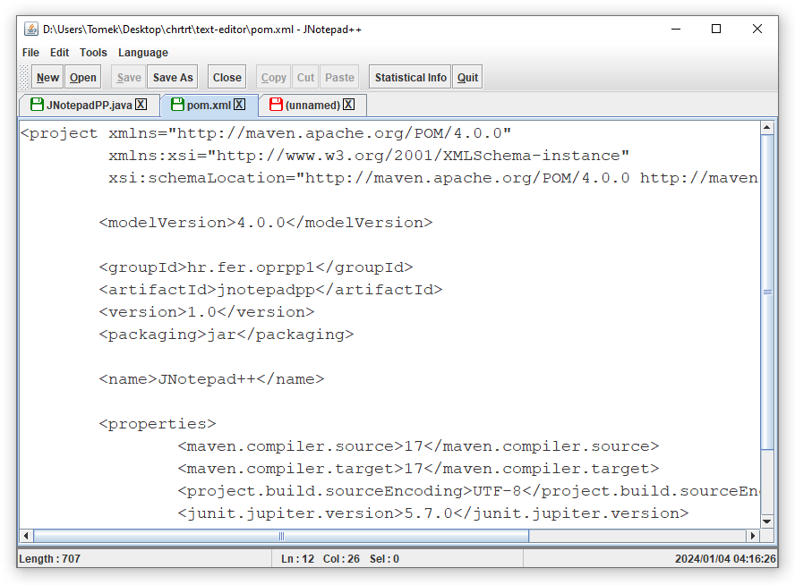

# JNotepad++

Simple GUI text editor app written in Java and Swing. Homework assignment for course [Selected Topics in Software Development 1](https://www.fer.unizg.hr/predmet/oprpp1).

## Prerequisites

Make sure you have installed all of the following:
* Java - JDK >=17, works with with older versions but requires minor changes in [pom.xml](pom.xml). Make sure to set the `JAVA_HOME` environment variable pointing to your JDK installation directory and make sure to have `bin` directory added to `PATH` environment variable.
* Maven - set the `M2_HOME` environment variable pointing to your Maven installation. Add the `bin` directory to `PATH` environment variable.

## Build

After cloning the repository, simply execute the following command:
```shell
mvn compile
```

## Run

Run using Java:
```shell
java -cp target/classes hr.fer.oprpp1.hw08.jnotepadpp.JNotepadPP
```

Run using Maven exec plugin:
```shell
mvn exec:java -Dexec.mainClass="hr.fer.oprpp1.hw08.jnotepadpp.JNotepadPP"
```

## Preview


